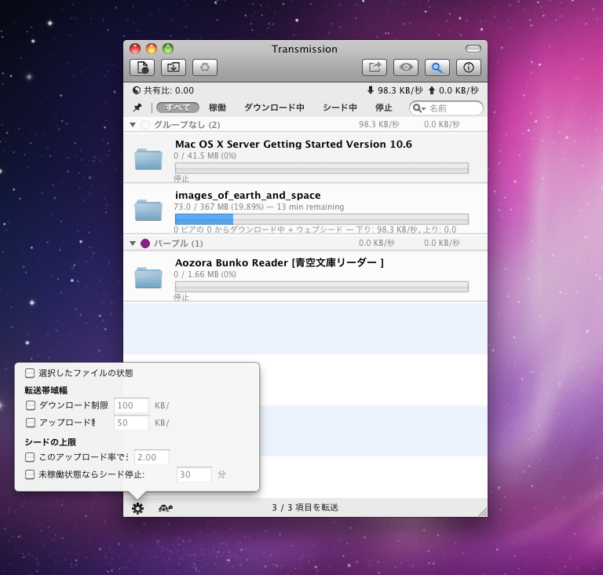

# Transmission 

A maintained 10.6+ macOS build of the latest Transmission.
Compatibility presets cover selected targets from Mac OS X 10.6 through macOS 10.13.

## Build
- [OS X 10.6 Snow Leopard](docs/macOS-10.6.md)
- [OS X 10.7 Lion through 10.13 High Sierra](docs/macOS-Legacy.md)

For modern builds, use the regular Transmission build documentation:

- [How to Build Transmission](docs/Building-Transmission.md)
- [Official Transmission site](https://transmissionbt.com/)

