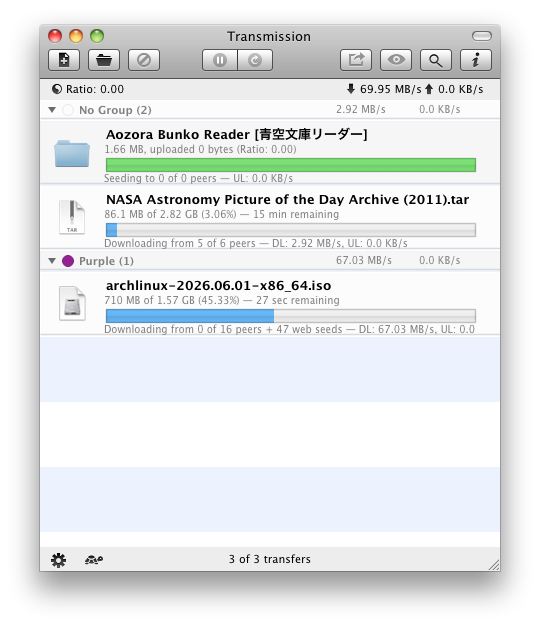
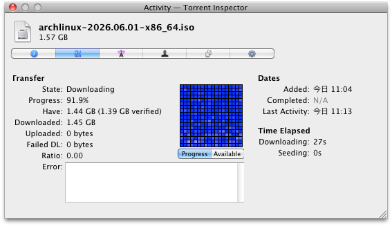
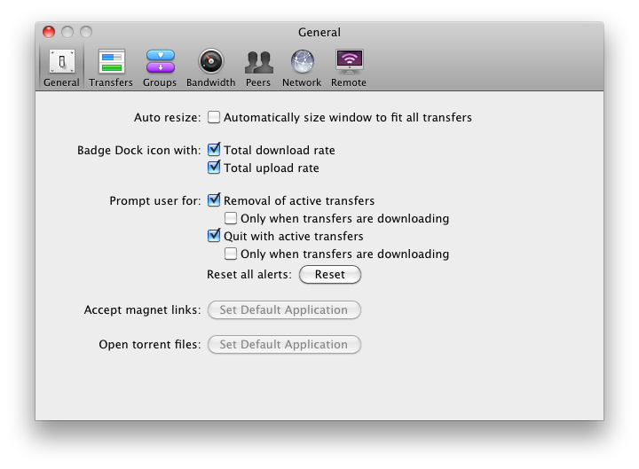
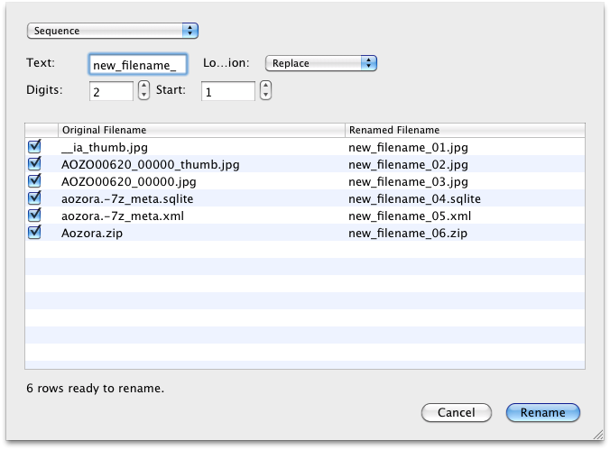
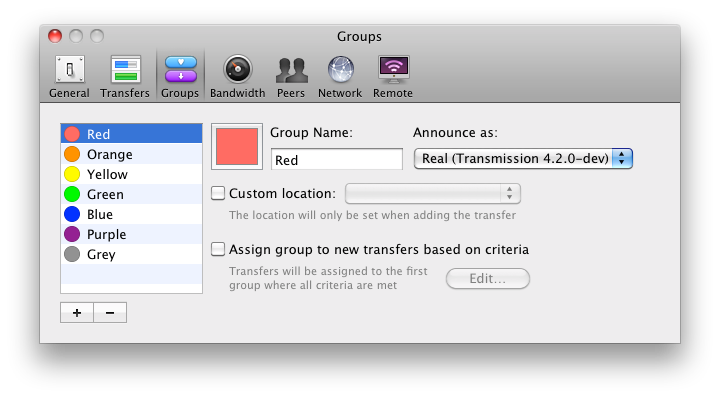

# Transmission 

Current Transmission, built for older Macs.

This fork keeps Transmission usable on Snow Leopard-era Macs. OS X 10.6 Snow Leopard through OS X 10.9 Mavericks and macOS 10.15 Catalina are tested. OS X 10.10-10.14 targets still need testing.

  

## What is different

- OS X 10.6 support, with compatibility presets covering 10.6 through 10.15.
- Torrent groups can use an **Announce as** setting to advertise a selected Transmission version to trackers. This is useful for trackers with strict client whitelists.
- Files inside a torrent can be renamed in batches, with a live preview before anything is changed.

The announce identity is applied where trackers and peers see it: HTTP user agent, peer ID prefix, and extension handshake client string. Batch rename supports replace, append, prepend, date, sequence, character removal, regular expression, and case changes.

Additional screenshots

  

  

  

  

## Build

- [Mac OS X 10.6 Snow Leopard](docs/macOS-10.6.md)
- [OS X 10.7 Lion through macOS 10.15 Catalina](docs/macOS-Legacy.md)

For modern builds, use the regular Transmission build documentation:

- [How to Build Transmission](docs/Building-Transmission.md)
- [Official Transmission site](https://transmissionbt.com/)
